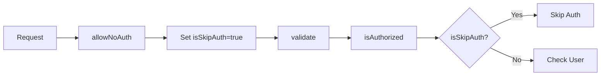

The `allowNoAuth` middleware marks an endpoint as public, bypassing authentication requirements. Use it for login, signup, health checks, and other publicly accessible endpoints.

## Usage

```javascript
import allowNoAuth from 'middlewares/allowNoAuth';
import { z } from 'zod';

export const middlewares = [allowNoAuth];

export const handler = async (ctx) => {
  ctx.body = { status: 'ok', timestamp: new Date() };
};

export const requestSchema = z.object({});

export const endpoint = {
  method: "GET",
  url: "/",
};
```

## How it works

`allowNoAuth` sets a flag that tells `isAuthorized` to skip authentication:

1. Sets `ctx.state.isSkipAuth = true`
2. Continues to the next middleware
3. When `isAuthorized` runs, it checks this flag and skips auth

<Note>
  `allowNoAuth` has `runOrder: -1`, so it runs **before** `isAuthorized` and validation.
</Note>

## When to use

Use `allowNoAuth` for:

- **Authentication endpoints** (login, signup, password reset)
- **Public data** (blog posts, product listings)
- **Health checks** (monitoring, load balancer probes)
- **Webhooks** (external service callbacks)
- **Documentation** (API specs, OpenAPI schemas)

## Implementation

```javascript /starter/src/middlewares/allowNoAuth.js
const middleware = async (ctx, next) => {
  ctx.state.isSkipAuth = true;
  return next();
};

middleware.runOrder = -1;

export default middleware;
```

## Context state

### Output

<ParamField path="ctx.state.isSkipAuth" type="boolean" default={true}>
  Flag that tells `isAuthorized` to skip authentication
</ParamField>

<ParamField path="ctx.state.user" type="null">
  Set to `null` by `isAuthorized` when authentication is skipped
</ParamField>

## Examples

### Public health check

```javascript /src/resources/health/endpoints/get.js
import allowNoAuth from 'middlewares/allowNoAuth';

export const middlewares = [allowNoAuth];

export const handler = async (ctx) => {
  ctx.body = { 
    status: 'ok',
    timestamp: new Date(),
    version: process.env.APP_VERSION
  };
};

export const endpoint = {
  method: "GET",
  url: "/",
};
```

### Login endpoint

```javascript /src/resources/auth/endpoints/login.js
import allowNoAuth from 'middlewares/allowNoAuth';
import db from 'db';
import { z } from 'zod';

const userService = db.services.users;
const tokenService = db.services.tokens;

export const middlewares = [allowNoAuth];

export const handler = async (ctx) => {
  const { email, password } = ctx.validatedData;

  const user = await userService.findOne({ email });

  if (!user || !await user.comparePassword(password)) {
    ctx.throw(401, { message: 'Invalid credentials' });
  }

  const token = await tokenService.create({ userId: user._id });

  ctx.cookies.set('access_token', token.value, {
    httpOnly: true,
    secure: true,
    sameSite: 'strict'
  });

  ctx.body = { user, token: token.value };
};

export const requestSchema = z.object({
  email: z.string().email(),
  password: z.string().min(8),
});

export const endpoint = {
  method: "POST",
  url: "/login",
};
```

### Public API with optional auth

Some endpoints work with or without authentication:

```javascript /src/resources/posts/endpoints/list.js
import allowNoAuth from 'middlewares/allowNoAuth';
import db from 'db';
import { z } from 'zod';

const postService = db.services.posts;

export const middlewares = [allowNoAuth];

export const handler = async (ctx) => {
  const query = { published: true };

  // Optional: if user is logged in, show drafts
  if (ctx.state.user) {
    query.$or = [
      { published: true },
      { authorId: ctx.state.user._id }
    ];
  }

  const posts = await postService.find(query);

  ctx.body = { posts };
};

export const requestSchema = z.object({});

export const endpoint = {
  method: "GET",
  url: "/",
};
```

<Tip>
  Even with `allowNoAuth`, global middlewares like `tryToAttachUser` still run. Check `ctx.state.user` to see if a user is authenticated.
</Tip>

### Webhook endpoint

```javascript /src/resources/webhooks/endpoints/stripe.js
import allowNoAuth from 'middlewares/allowNoAuth';
import { z } from 'zod';

export const middlewares = [allowNoAuth];

export const handler = async (ctx) => {
  const signature = ctx.headers['stripe-signature'];

  // Verify webhook signature
  const event = verifyStripeWebhook(
    ctx.request.rawBody,
    signature
  );

  // Process event
  await handleStripeEvent(event);

  ctx.body = { received: true };
};

export const requestSchema = z.object({});

export const endpoint = {
  method: "POST",
  url: "/stripe",
};
```

## Global authentication mode

When `isRequireAuthAllEndpoints` is enabled, all endpoints require authentication by default:

```javascript /src/app-config/app.js
export default {
  _hive: {
    isRequireAuthAllEndpoints: true
  }
};
```

In this mode, `allowNoAuth` is **required** for public endpoints:

<CodeGroup>
```javascript Protected (default)
// No middleware needed - auth required by default
export const handler = async (ctx) => {
  ctx.body = ctx.state.user; // user always exists
};
```

```javascript Public (explicit)
import allowNoAuth from 'middlewares/allowNoAuth';

// Must use allowNoAuth to make public
export const middlewares = [allowNoAuth];

export const handler = async (ctx) => {
  ctx.body = { status: 'ok' }; // no user required
};
```
</CodeGroup>

<Warning>
  Don't forget to add `allowNoAuth` to login and signup endpoints when `isRequireAuthAllEndpoints` is enabled, or users won't be able to authenticate.
</Warning>

## Execution order

`allowNoAuth` runs **before** other middlewares:

```javascript
allowNoAuth.runOrder = -1;  // Runs first
validate.runOrder = 0;      // Runs second (built-in)
isAuthorized.runOrder = 0;  // Runs third (checks isSkipAuth flag)
```

This ensures the skip flag is set before `isAuthorized` checks it:



## Security considerations

<AccordionGroup>
  <Accordion title="Don't expose sensitive data">
    Public endpoints should only return non-sensitive information:

    ```javascript
    // Bad - exposes all user data
    export const middlewares = [allowNoAuth];
    export const handler = async (ctx) => {
      const users = await userService.find({});
      ctx.body = { users }; // Includes emails, hashed passwords, etc.
    };

    // Good - only public fields
    export const middlewares = [allowNoAuth];
    export const handler = async (ctx) => {
      const users = await userService.find({}, {
        _id: 1,
        name: 1,
        avatar: 1
      });
      ctx.body = { users };
    };
    ```
  </Accordion>

  <Accordion title="Validate webhook signatures">
    Public webhook endpoints should verify signatures:

    ```javascript
    export const middlewares = [allowNoAuth];
    export const handler = async (ctx) => {
      const signature = ctx.headers['x-webhook-signature'];
      
      if (!verifySignature(ctx.request.body, signature)) {
        ctx.throw(401, { message: 'Invalid signature' });
      }

      // Process webhook
    };
    ```
  </Accordion>

  <Accordion title="Rate limit public endpoints">
    Prevent abuse with rate limiting:

    ```javascript
    import allowNoAuth from 'middlewares/allowNoAuth';
    import rateLimit from 'middlewares/rateLimit';

    export const middlewares = [
      allowNoAuth,
      rateLimit({ max: 10, window: '1m' })
    ];
    ```
  </Accordion>
</AccordionGroup>

## Related middlewares

<CardGroup cols={2}>
  <Card title="isAuthorized" icon="lock" href="/api/middlewares/is-authorized">
    Require authentication for protected endpoints
  </Card>
  <Card title="attachUser" icon="user" href="/api/middlewares/attach-user">
    Optionally attach user if token exists
  </Card>
</CardGroup>

## See also

- [Middleware system](/api/middlewares/overview)
- [Authentication guide](/guides/authentication)
- [App configuration](/api/helpers/config)
