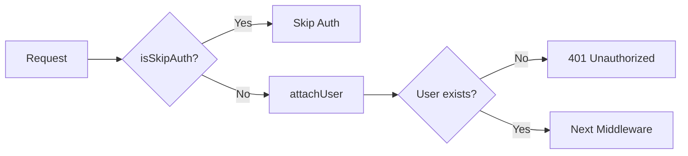

The `isAuthorized` middleware ensures a valid authenticated user exists before allowing access to an endpoint. It returns `401 Unauthorized` if no user is found.

## Usage

```javascript
import isAuthorized from 'middlewares/isAuthorized';
import { z } from 'zod';

export const middlewares = [isAuthorized];

export const handler = async (ctx) => {
  // ctx.state.user is guaranteed to exist
  ctx.body = { message: `Welcome ${ctx.state.user.name}` };
};

export const requestSchema = z.object({});

export const endpoint = {
  method: "GET",
  url: "/profile",
};
```

## How it works

`isAuthorized` performs the following steps:

1. Checks if `ctx.state.isSkipAuth` is set (by `allowNoAuth`)
2. Calls `attachUser` to extract and validate the authentication token
3. Returns `401` if no user is found
4. Continues to the next middleware if user exists

<Note>
  `isAuthorized` internally uses `attachUser` to load the user from the token.
</Note>

## Authentication flow



## Token extraction

The middleware looks for authentication tokens in this order:

1. **Cookie**: `access_token` cookie
2. **Authorization header**: `Authorization: Bearer <token>`
3. **Custom header**: Configured via `config._hive.authHeaderName`

<CodeGroup>
```bash Cookie
curl -X GET https://api.example.com/users/me \
  -H "Cookie: access_token=eyJhbGc..."
```

```bash Authorization Header
curl -X GET https://api.example.com/users/me \
  -H "Authorization: Bearer eyJhbGc..."
```

```bash Custom Header
# With config._hive.authHeaderName = 'x-api-token'
curl -X GET https://api.example.com/users/me \
  -H "x-api-token: eyJhbGc..."
```
</CodeGroup>

## Context state

### Input

<ParamField path="ctx.state.isSkipAuth" type="boolean" default={false}>
  Set by `allowNoAuth` to bypass authentication
</ParamField>

### Output

<ParamField path="ctx.state.user" type="object" required>
  The authenticated user object loaded from the database
</ParamField>

<ParamField path="ctx.state.user.authMetadata" type="object">
  Optional metadata from the authentication token
</ParamField>

<ParamField path="ctx.state.accessToken" type="string">
  The raw authentication token extracted from the request
</ParamField>

## Implementation

```javascript /starter/src/middlewares/isAuthorized.js
import attachUser from './attachUser';

export default async (ctx, next) => {
  if (ctx.state.isSkipAuth) {
    ctx.state.user = null;
    return next();
  }

  await attachUser(ctx, async () => {
    if (ctx.state.user) {
      return next();
    }

    ctx.status = 401;
    ctx.body = {};
    return null;
  });
};
```

## Examples

### Protected endpoint

```javascript /src/resources/posts/endpoints/create.js
import isAuthorized from 'middlewares/isAuthorized';
import db from 'db';
import { z } from 'zod';

const postService = db.services.posts;

export const middlewares = [isAuthorized];

export const handler = async (ctx) => {
  const post = await postService.create({
    ...ctx.validatedData,
    authorId: ctx.state.user._id,
  });

  ctx.body = post;
};

export const requestSchema = z.object({
  title: z.string(),
  content: z.string(),
});

export const endpoint = {
  method: "POST",
  url: "/",
};
```

### Using authentication metadata

```javascript /src/resources/sessions/endpoints/current.js
import isAuthorized from 'middlewares/isAuthorized';

export const middlewares = [isAuthorized];

export const handler = async (ctx) => {
  ctx.body = {
    user: ctx.state.user,
    sessionMetadata: ctx.state.user.authMetadata,
    tokenUsed: ctx.state.accessToken,
  };
};
```

### Combining with other middlewares

```javascript /src/resources/posts/endpoints/update.js
import isAuthorized from 'middlewares/isAuthorized';
import shouldExist from 'middlewares/shouldExist';
import db from 'db';
import { z } from 'zod';

const postService = db.services.posts;

export const middlewares = [
  isAuthorized,
  shouldExist('posts', {
    criteria: (ctx) => ({ 
      _id: ctx.params.postId,
      authorId: ctx.state.user._id // Ensure ownership
    })
  })
];

export const handler = async (ctx) => {
  const updated = await postService.updateOne(
    { _id: ctx.state.post._id },
    ctx.validatedData
  );

  ctx.body = updated;
};

export const requestSchema = z.object({
  postId: z.string(),
  title: z.string().optional(),
  content: z.string().optional(),
});

export const endpoint = {
  method: "PATCH",
  url: "/:postId",
};
```

## Global authentication

Require authentication for all endpoints by default:

```javascript /src/app-config/app.js
export default {
  _hive: {
    isRequireAuthAllEndpoints: true
  }
};
```

With this setting, `isAuthorized` is automatically added to all endpoints. Use `allowNoAuth` to create public endpoints:

```javascript /src/resources/health/endpoints/get.js
import allowNoAuth from 'middlewares/allowNoAuth';

export const middlewares = [allowNoAuth];

export const handler = async (ctx) => {
  ctx.body = { status: 'ok' };
};
```

<Warning>
  When `isRequireAuthAllEndpoints` is enabled, you must explicitly use `allowNoAuth` for public endpoints like login, signup, and health checks.
</Warning>

## Error responses

### 401 Unauthorized

Returned when no valid user is found:

```json
{
  "status": 401,
  "body": {}
}
```

<Tip>
  The error handler automatically formats 401 responses. You can customize this in `/src/routes/middlewares/routeErrorHandler.js`.
</Tip>

## Related middlewares

<CardGroup cols={2}>
  <Card title="allowNoAuth" icon="lock-open" href="/api/middlewares/allow-no-auth">
    Skip authentication for public endpoints
  </Card>
  <Card title="attachUser" icon="user" href="/api/middlewares/attach-user">
    Attach user without requiring authentication
  </Card>
</CardGroup>

## See also

- [Middleware system](/api/middlewares/overview)
- [Authentication guide](/guides/authentication)
