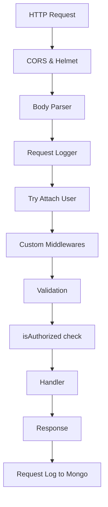

Hive is built on proven, boring technology that scales. It preconfigures the entire backend stack so you don't have to duct-tape different pieces together.

## Core design principles

Hive follows three key principles:

1. **Convention over configuration** — Predictable folder structure eliminates boilerplate
2. **AI-native development** — Clear patterns that AI coding assistants understand
3. **Less code, better outcomes** — Minimize cognitive overhead and maximize productivity

## Tech stack

<CardGroup cols={2}>
  <Card title="Koa" icon="server">
    Lightweight Node.js framework for HTTP middleware
  </Card>
  <Card title="MongoDB" icon="database">
    Document database with auto-generated services
  </Card>
  <Card title="Zod" icon="shield-check">
    TypeScript-first schema validation
  </Card>
  <Card title="Socket.io" icon="bolt">
    Real-time bidirectional event-based communication
  </Card>
  <Card title="BullMQ" icon="list-check">
    Redis-based queue for background jobs
  </Card>
  <Card title="Redis" icon="memory">
    Cache and pub/sub for scaling
  </Card>
</CardGroup>

## How Hive works

When you run `npx hive run ./src`, here's what happens:

<Steps>
  <Step title="CLI copies framework">
    The CLI copies the `starter/` directory to `.hive/` in your project. This becomes your runtime framework.
  </Step>
  
  <Step title="Framework loads user code">
    The framework reads from `process.env.HIVE_SRC` (set to `./src`) to discover your schemas, endpoints, and handlers.
  </Step>
  
  <Step title="Merge and bootstrap">
    User code merges with framework code at runtime. Your resources extend built-in ones (users, tokens, health).
  </Step>
  
  <Step title="Server starts">
    Koa server boots with all routes, middlewares, and database services auto-configured.
  </Step>
</Steps>

<Note>
  The `.hive/` folder is auto-generated and should never be edited. All your code lives in `src/`.
</Note>

## Startup sequence

Here's how Hive bootstraps your application (from `starter/src/app.js:24`):

```javascript
const main = async () => {
  await config.init();
  await db.init();

  const routes = (await import("routes")).default;
  const scheduler = (await import("./scheduler")).default;

  process.on("unhandledRejection", (reason, p) => {
    console.trace(reason.stack);
    logger.error(reason.stack);
  });

  const app = new Koa();

  app.use(cors({ credentials: true }));
  app.use(helmet());

  qs(app);

  app.use(bodyParser({
    enableTypes: ["json", "form", "text"],
    formLimit: config._hive.bodyParser?.formLimit || "10mb",
    textLimit: config._hive.bodyParser?.textLimit || "10mb",
    jsonLimit: config._hive.bodyParser?.jsonLimit || "10mb",
  }));

  app.use(mount("/health", get.handler));
  app.use(requestLogger());

  await routes(app);

  const server = http.createServer(app.callback());

  server.listen(config.port, () => {
    console.log(`Api server listening on ${config.port}`);
  });

  scheduler();

  await socketIo(server);
};
```

<Accordion title="What happens during config.init()">
  - Loads environment variables
  - Validates required configuration
  - Sets up database connection strings
  - Configures auth settings
</Accordion>

<Accordion title="What happens during db.init()">
  - Scans for all schema files in resources
  - Creates MongoDB services for each schema
  - Registers event handlers
  - Sets up auto-sync mappings
</Accordion>

## Resource discovery

Hive automatically discovers your resources by scanning both framework and user code (from `starter/src/helpers/getResources.js:16`):

```javascript
export default async () => {
  let resourceDirs = await getDirectories(`${__dirname}/../resources`);

  if (process.env.HIVE_SRC) {
    let hiveResourcesDirPath = `${process.env.HIVE_SRC}/resources`;
   
    if (fs.existsSync(hiveResourcesDirPath)) {
      resourceDirs = _.uniqBy([
        ...resourceDirs, 
        ...((await getDirectories(hiveResourcesDirPath))
          .map(r => ({ dirName: r.dirName, isHive: true })))
      ], r => r.dirName);
    }
  }

  return resourceDirs
    .filter(({ dirName }) => dirName !== "health")
    .map(({ dirName }) => ({
      name: dirName,
    }));
};
```

<Tip>
  User resources take precedence over framework resources with the same name. This allows you to override built-in behavior.
</Tip>

## Request lifecycle

Every HTTP request flows through these layers:



<Steps>
  <Step title="Security layer">
    CORS and Helmet middleware protect against common vulnerabilities.
  </Step>
  
  <Step title="Parse request">
    Body parser handles JSON, form data, and text up to 10MB by default.
  </Step>
  
  <Step title="Attach user">
    `tryToAttachUser` middleware checks for auth tokens and attaches user to `ctx.state.user`.
  </Step>
  
  <Step title="Validate input">
    Zod schema validates request body, query params, and URL params.
  </Step>
  
  <Step title="Run middlewares">
    Custom middlewares run in order (sorted by `runOrder` property).
  </Step>
  
  <Step title="Execute handler">
    Your endpoint handler runs and returns a response.
  </Step>
  
  <Step title="Log to database">
    Request metadata is logged to `_request_logs` collection for debugging.
  </Step>
</Steps>

## Database layer

Hive auto-generates a service for every schema you define. Services provide a clean API over MongoDB:

```javascript
import db from 'db';

const usersService = db.services.users;

// All schemas are accessible
const usersSchema = db.schemas.users;
```

The database layer (from `starter/src/db.js:14`) initializes like this:

```javascript
db.init = async () => {
  const schemaPaths = await getSchemas();

  await Promise.all(_.map(
    schemaPaths,
    async ({ file: schemaFile, resourceName, name: schemaName }) => {
      let { default: schema, secureFields = [] } = (await import(schemaFile));

      // Allow user to extend framework schemas
      if (process.env.HIVE_SRC) {
        let extendSchemaPath = `${process.env.HIVE_SRC}/resources/${resourceName}/${schemaName}.extends.schema.js`;
        if (fs.existsSync(extendSchemaPath)) {
          let extendsSchema = (await import(extendSchemaPath)).default;
          schema = schema.append(extendsSchema);
        }
      }
      
      db.schemas[schemaName] = schema;

      db.services[schemaName] = db.createService(`${resourceName}`, {
        validate: (obj) => {
          return { value: schema.parse(obj) };
        },
        secureFields: secureFields,
      });
    }
  ));

  // Import all handlers after services are created
  const resourcePaths = await getResources();
  setTimeout(() => {
    _.each(resourcePaths, ({ name }) => {
      importHandlers(name)
    });
  }, 0);

  // Set up auto-sync
  (await import("autoMap/addHandlers")).default();
  (await import("autoMap/mapSchema")).default();
};
```

<Warning>
  Handlers are imported with `setTimeout(() => {...}, 0)` to ensure all services exist before handlers try to reference them.
</Warning>

## Middleware system

Middlewares can be:

- **Global** — Run on every request
- **Per-endpoint** — Specified in endpoint files
- **Framework-provided** — Built-in like `isAuthorized`, `attachUser`

Middlewares have a `runOrder` property (defaults to `1`). Lower numbers run first:

```javascript
// Global middleware runs first
globalMiddleware.runOrder = 0;

// Auth check runs before custom middlewares
isAuthorized.runOrder = 0;

// Custom middlewares default to 1
customMiddleware.runOrder = 1;
```

## Event system

Hive uses an event-driven architecture for side effects:

- Database services emit `created`, `updated`, `removed` events
- Handlers subscribe to these events
- Auto-sync uses handlers to keep embedded docs fresh
- You write handlers for custom business logic

This decouples data changes from side effects, making code easier to test and maintain.

## Configuration

Hive reads configuration from:

1. **Environment variables** — Set in `.env` or deployment platform
2. **src/app-config/app.js** — Your custom config
3. **Framework defaults** — Sensible defaults in `.hive/`

User config merges with framework config, with user values taking precedence.

## Folder structure

```
my-app/
├── src/                      # Your code (HIVE_SRC)
│   ├── resources/
│   │   └── tasks/
│   │       ├── tasks.schema.js
│   │       ├── endpoints/
│   │       ├── handlers/
│   │       └── methods/
│   ├── middlewares/          # Custom middlewares
│   ├── services/             # External API clients
│   ├── scheduler/handlers/   # Cron jobs
│   └── app-config/           # App configuration
├── .hive/                    # Framework (auto-generated)
│   └── src/
│       ├── app.js            # Bootstrap
│       ├── db.js             # Database layer
│       ├── routes/           # Route registration
│       ├── middlewares/      # Built-in middlewares
│       └── resources/        # Built-in resources
└── .env                      # Environment variables
```

<Tip>
  Think of `.hive/` as node_modules — it's managed by the framework, not you.
</Tip>

## Scaling considerations

<AccordionGroup>
  <Accordion title="Horizontal scaling">
    - Socket.io uses Redis adapter for multi-server setups
    - BullMQ queues work across multiple instances
    - MongoDB connection pooling handles concurrent requests
  </Accordion>
  
  <Accordion title="Database performance">
    - Add indexes in migration files
    - Use `fields` parameter to limit returned data
    - Leverage MongoDB aggregations for complex queries
  </Accordion>
  
  <Accordion title="Background jobs">
    - Long-running tasks should use BullMQ
    - Handlers run synchronously — keep them fast
    - Use scheduler for periodic tasks
  </Accordion>
</AccordionGroup>

## What's preconfigured

Out of the box, Hive gives you:

- **Authentication** — Token-based auth with users and tokens resources
- **Request logging** — All requests logged to `_request_logs` collection
- **Error handling** — Structured error responses with client-friendly messages
- **CORS & security** — Configured for production use
- **Real-time** — Socket.io ready for WebSocket connections
- **Validation** — Zod schemas auto-applied to all endpoints
- **Auto-sync** — Embedded documents stay fresh automatically

You focus on your product. Hive handles the plumbing.